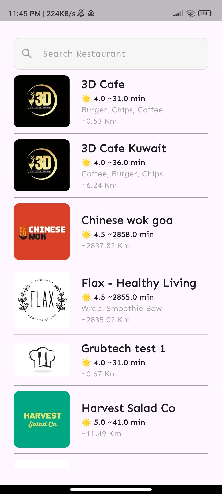
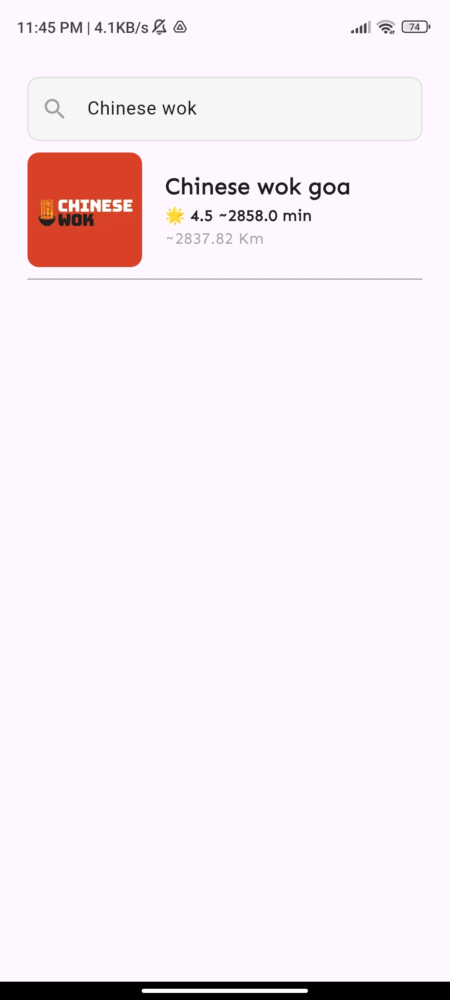
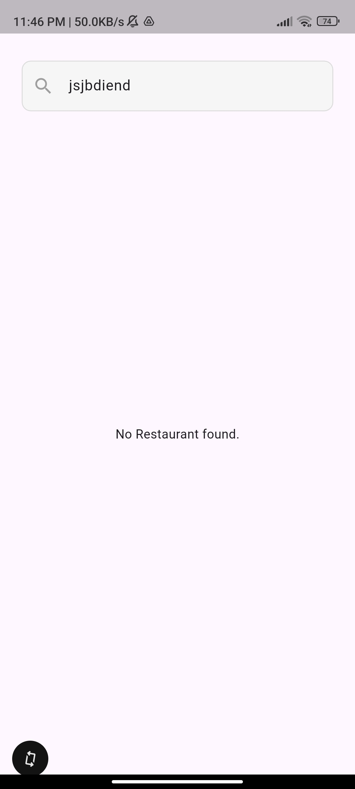
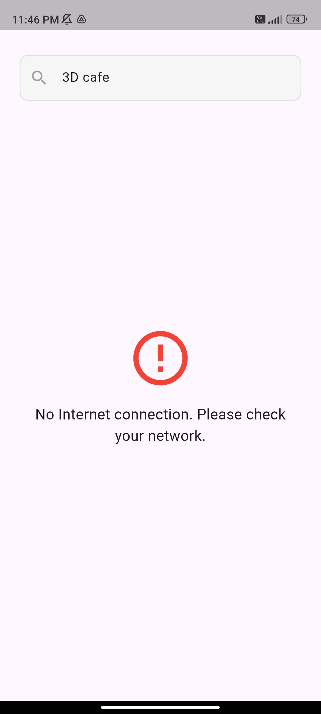
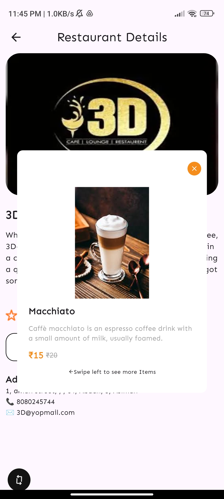
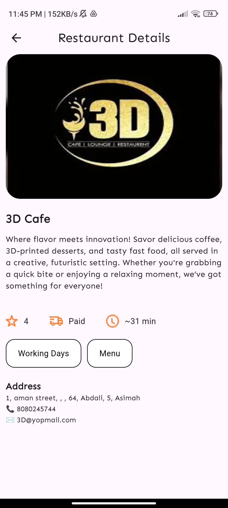
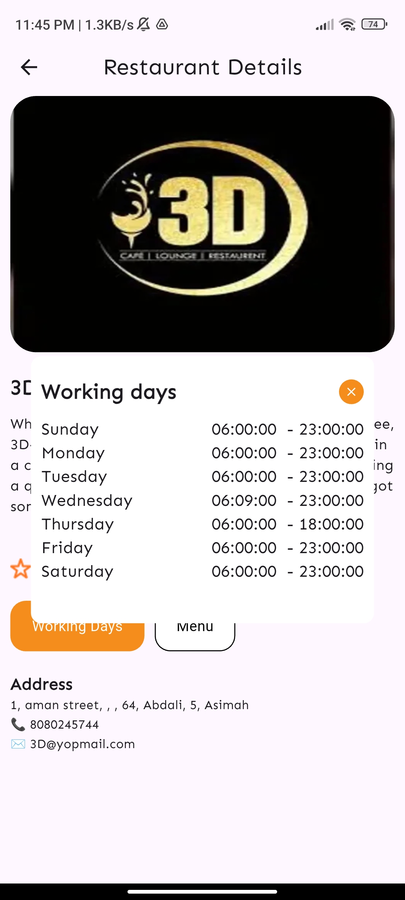

# restaurant_app

A restaurant app project.

## Environment Specs

- Flutter SDK: 3.38.7
- Dart SDK: 3.10.7
- Gradle: 8.14
- Android Gradle Plugin: 8.11.1
- JDK: 21
- Min SDK: 23
- Target SDK: 34
- Build Variant: release

## Screenshots

## 📸 Screenshots

  
  
  
  
   
  
  

## Demo Video

- Demo Link :- https://drive.google.com/file/d/168TO-sqlezglCEL8PPi-X4ZkoTtJ50pe/view?usp=drive_link
- APK Link :- https://drive.google.com/file/d/1NNk38b6zZpSBE6mW2uMdwFtNQmWvWjFB/view?usp=drive_link
